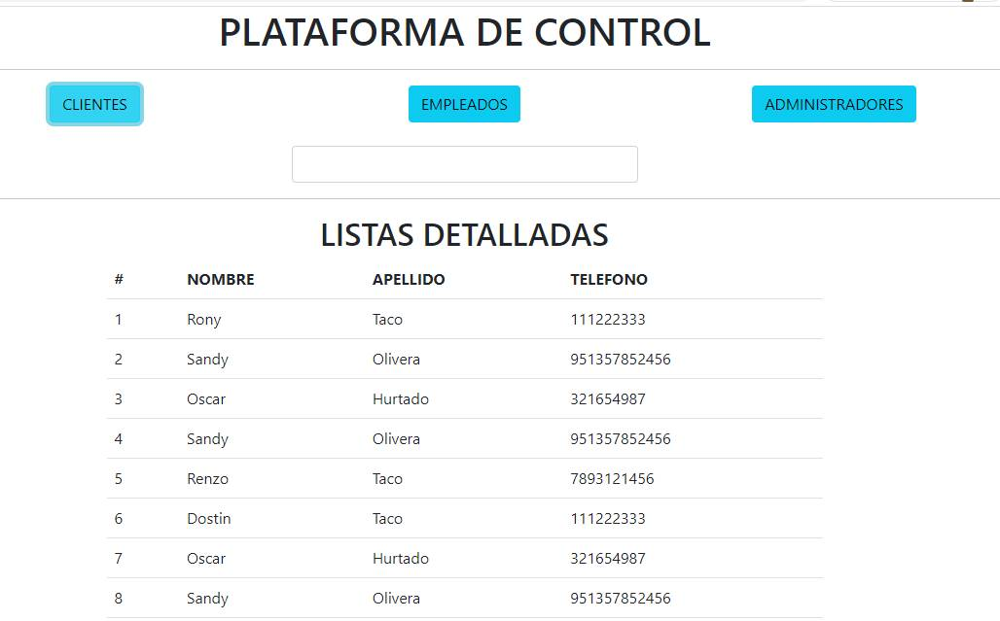
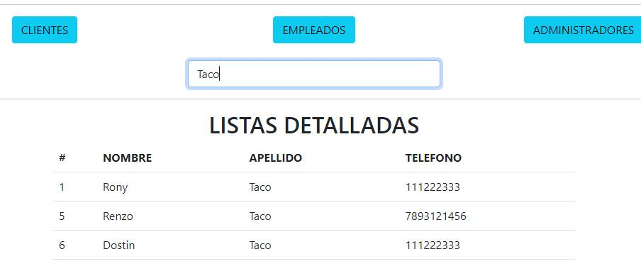
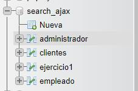

# PLATFORM CONTROL - SEARCH DATA WITH PHP, AJAX, MYSQL, BOOTSTRAP, JQUERY. 🔎

How to search for anything from the MySQL databases using the search bar and displaying the search results using three tables.

* Customers
* Administrators
* Employees

## STACK TECH :wrench: :hammer:

* PHP
* MySql
* Jquery
* AJAX
* Bootstrap

# SCREENSHOT

